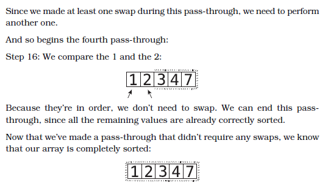

|Tag|Problem|Description|
|---|-------|-----------|
| recursion | [**anagrams**](recursion/anagrams.py) | Find all anagrams of a string 
| recursion | [**count x**](recursion/count_x.py) | Count number of x's in a string
| recursion | [**double array**](recursion/double_array.py) | Double the contents of an int/double array
| recursion | [**gcd of array**](recursion/gcd.py) | Find gcd of an array
| recursion, linked list | [**merge alternatively**](recursion/mergeAlternatively.py) | Merge two linked lists alternatively 
| recursion | [**palindrome**](recursion/palindrome.py) | Determine if a string is a palindrome
| recursion | [**staircase**](recursion/staircase.py) | Let’s say we have a staircase of N steps, and a person has the ability to climb one, two, or three steps at a time. How many different possible “paths” can someone take to reach the top? 
| recursion | [**string reversal**](recursion/string_reversal.py) | Reverse a string
| recursion | [**sum array**](recursion/sumArr.py) | Find the sum of all numbers in an array 
| recursion | [**triangular numbers**](recursion/triangular_numbers.py) | 

|Tag|Problem|Description|
|---|-------|-----------|
| bst | [**set to height**](bst/bst.py) | Set each node on a binary tree to its height
| bst | [**inorder traversal**](bst/inorder_traversal.py) | Return an array populated by bst traversal

|Tag|Problem|Description|
|---|-------|-----------|
|DP | [**fibonacci**](dp/bottom-up/fib.py) | Find the nth fibonacci number

## BLIND 75

|Tag|Problem|Description|Difficulty
|---|-------|-----------|-----------
|array| [**Two Sum**](array/two_sum.py) | Return indices of the two numbers such that they add up to target | Easy
|array| [**Best Time to Buy and Sell Stock**](array/maxProf.py) | Return maximum profit from array of buying and selling prices | Easy
|array| [**Contains Duplicate**](array/containsDuplicate.py) | Return bool if array contains duplicate element | Easy
|array| [**Maximum Product Subarray**](array/maxProduct.py) | Return bool if array contains duplicate element | Easy
|array| [**Product of Array Except Self**](array/productExceptSelf.py) | Return an array such that `answer[i]` is equal to the product of all the elements of `nums` except `nums[i]`. | Medium
|array| [**Maximum Sum Subarray**](array/maxSubArray.py) | Find the contiguous subarray with the largest sum| Medium
|array| [**Find Minimum in Rotated Sorted Array**](array/findMin.py) | Return the index of the minimum in a rotated array in `Olog(n)` time | Medium
|array| [**Search in Rotated Sorted Array**](array/search.py) | Return the index of the target in a rotated array in `Olog(n)` time | Medium

## Sorting Algorithms
### Bubble Sort O(N<sup>2</sup>)



```python
def bubbleSort(nums):
    sorted = False
    unsortedTilIndex = len(nums) - 1
    while not sorted:
        sorted = True
        for i in range(unsortedTilIndex):
            if nums[i] > nums[i + 1]:
                sorted = False
                nums[i], nums[i + 1] = nums[i + 1], nums[i]
        unsortedTilIndex -= 1
    return nums
```
### Insertion Sort O(N<sup>2</sup>)


```python
def insertionSort(nums):
    for i in range(1, len(nums)):
        # store current number in temporary variable
        temp = nums[i]
        pointer = i
        sorted = False
        while not sorted and pointer > 0:
            if temp >= nums[pointer - 1]:
                sorted = True
            else:
                # -> shift previous to the right
                nums[pointer] = nums[pointer - 1]
                # -> move pointer left
                pointer -= 1
        # insert temp where pointer is pointing
        nums[pointer] = temp
    return nums
```
### Quicksort O(NLogN)
#### Partioning


```python
def quicksort(nums):
    helper(nums, 0, len(nums) - 1)
    return nums

def helper(nums, l, r):
    if l >= r:
        return
    pivot = partition(nums, l, r)
    helper(nums, l, pivot - 1)
    helper(nums, pivot + 1, r)

def partition(nums, l, r):
    pivot = r
    r -= 1
    sorted = False
    while not sorted:
        while nums[l] < nums[pivot]:
            l += 1
        while nums[r] > nums[pivot]:
            r += 1
        if l >= r:
            sorted = True
        else:
            nums[l], nums[r] = nums[r], nums[l]
    nums[l], nums[pivot] = nums[pivot], nums[l]
    return l
```
#### 3 way partitioning


```python
def quicksort(nums):
    helper(nums, 0, len(nums) - 1)
    return nums

def helper(nums, l, r):
    if l >= r:
        return
    lt, gt = partition(nums, l, r)
    helper(nums, l, lt - 1)
    helper(nums, gt + 1, r)

def partition(nums, lo, hi): 
    lt, pivot, gt = lo, nums[lo], hi
    i = lo + 1
    while i <= gt:
        if nums[i] > pivot:
            nums[i], nums[gt] = nums[gt], nums[i]
            gt -= 1
        elif nums[i] < pivot:
            nums[lt], nums[i] = nums[i], nums[lt]
            lt += 1 
            i += 1
        else:
            i += 1
    return lt, gt
```
### Mergesort O(NLogN)


```python
def mergeSort(nums):
    helper(nums)
    return nums

def helper(nums):
    if len(nums) <= 1:
        return
    mid = len(nums)//2
    L = nums[:mid]
    R = nums[mid:]
    helper(L)
    helper(R)
    merge(L, R, nums)
    
def merge(L, R, nums):
    i = j = k = 0 
    while i < len(L) and j < len(R):
        if L[i] <= R[j]:
            nums[k] = L[i]
            i += 1
        else:
            nums[k] = R[j]
            j += 1
        k += 1
    # when L or R are unequal lengths
    while i < len(L):
        nums[k] = L[i]
        i += 1
        k += 1
    while j < len(R):
        nums[k] = R[j]
        j += 1
        k += 1
```