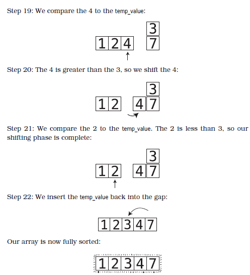
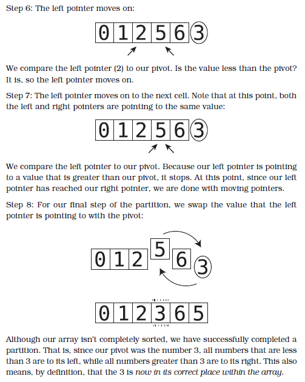

### Table of Contents
1. [Recursion](#Recursion)
2. [BST](#BST)
3. [Linked List](#Linked-List)
4. [DP](#DP)
5. [Blind 75](#Blind-75)
6. [CTCI](#CTCI)   
7. [Sorting Algorithms](#Sorting-Algorithms)
<br/>&nbsp;&nbsp;&nbsp;&nbsp;&nbsp;&nbsp;a. [Bubble Sort](#Bubble-Sort-ON2)
<br/>&nbsp;&nbsp;&nbsp;&nbsp;&nbsp;&nbsp;b. [Insertion Sort](#Insertion-Sort-ON2)
<br/>&nbsp;&nbsp;&nbsp;&nbsp;&nbsp;&nbsp;c. [Quicksort](#Quicksort-ONLogN)
<br/>&nbsp;&nbsp;&nbsp;&nbsp;&nbsp;&nbsp;d. [Mergesort](#Mergesort-ONLogN)

## Recursion
|Tag|Problem|Description|Difficulty
|---|-------|-----------|-----------
| recursion | [**anagrams**](recursion/anagrams.py) | Find all anagrams of a string 
| recursion | [**count x**](recursion/count_x.py) | Count number of x's in a string
| recursion | [**double array**](recursion/double_array.py) | Double the contents of an int/double array
| recursion | [**gcd of array**](recursion/gcd.py) | Find gcd of an array
| recursion | [**palindrome**](recursion/palindrome.py) | Determine if a string is a palindrome
| recursion | [**staircase**](recursion/staircase.py) | Let’s say we have a staircase of N steps, and a person has the ability to climb one, two, or three steps at a time. How many different possible “paths” can someone take to reach the top? 
| recursion | [**string reversal**](recursion/string_reversal.py) | Reverse a string
| recursion | [**sum array**](recursion/sumArr.py) | Find the sum of all numbers in an array 
| recursion | [**triangular numbers**](recursion/triangular_numbers.py) | Pattern 1, 3, 6, 10, 15, 21 where N<sup>th</sup> number is N plus the previous number 
| recursion, linked list | [**merge alternatively**](recursion/mergeAlternatively.py) | Merge two linked lists alternatively
| recursion, linked list, Blind 75 | [**merge**](linked_lists/merge.py) | Merge two sorted linked lists in increasing order | M

## Tree
|Tag|Problem|Description|
|---|-------|-----------|
| tree | [**Set to Height**](bst/bst.py) | Set each node on a binary tree to its height
| tree | [**Inorder Traversal**](bst/inorder_traversal.py) | Return an array populated by bst traversal
| tree, Blind 75 | [**Same Tree**](bst/same_tree.py) | Determine if two trees are the same | M
| tree, Blind 75, queue | [**Level Order Traversal**](bst/level_order_traversal.py) | Return the level order traversal of a tree | M
| tree, Blind 75, queue| [**Subtree of Another Tree**](bst/subtree.py)| Given `root` and `subroot`, determine if `root` has a subtree that matches `subroot` | M

## Linked List
|Tag|Problem|Description|Difficulty
|---|-------|-----------|----------
| linked list | [**Palindrome Linked List**](linked_lists/palindrome.py) | Determine if linked list is palindrome | M
| linked list | [**Reverse Linked List II**](linked_lists/reverse_linked_lists_ii.py) | Reverse linked list from position `left` to `right` | M
| linked list | [**Reorder List**](linked_lists/reorder_list.py) | Reorder `L0 → L1 → … → Ln - 1 → Ln` to `L0 → Ln → L1 → Ln - 1 → L2 → Ln - 2 → … `| M
| linked list, recursion | [**Sort**](linked_lists/sort.py) | Sort linked list in `Olog(n)` time and `O(1)` | M
| linked list, recursion | [**Merge Alternatively**](recursion/mergeAlternatively.py) | Merge two linked lists alternatively | M
| linked list, Blind 75 | [**Remove Nth Node from End of List**](linked_lists/removeNthFromEnd.py) | Remove the nth node from the end of a linked list | M
| linked list, CTCI | [**Intersection of Two Linked Lists**](linked_lists/intersection.py) | Return the intersecting node between two linked lists (if there is one) | E
| linked list, recursion, Blind 75 | [**Merge**](linked_lists/merge.py) | Merge two sorted linked lists in increasing order | M 
| IMPLICIT linked list | [**Happy Number**](linked_lists/implicit/happy_number.py) | Determine if a number is happy. A happy number is a number whose sum of its digits squared is taken until it reaches 1 otherwise loops endlessly and is not a happy number.|M
| IMPLICIT linked list | [**Find the Duplicate Number**](linked_lists/implicit/find_duplicate.py) | Given an array of integers nums containing n + 1 integers where each integer is in the range [1, n] inclusive. There is only one repeated number in nums, return this repeated number. | M

## DP
|Tag|Problem|Description|
|---|-------|-----------|
|DP | [**fibonacci**](dp/bottom-up/fib.py) | Find the nth fibonacci number


## BLIND 75

|Tag|Problem|Description|Difficulty
|---|-------|-----------|-----------
|array| [**Two Sum**](array/two_sum.py) | Return indices of the two numbers such that they add up to target | E
|array| [**Best Time to Buy and Sell Stock**](array/maxProf.py) | Return maximum profit from array of buying and selling prices | E
|array| [**Contains Duplicate**](array/containsDuplicate.py) | Return bool if array contains duplicate element | E
|array| [**Maximum Product Subarray**](array/maxProduct.py) | Find the contiguous subarray with the largest product | M
|array| [**Product of Array Except Self**](array/productExceptSelf.py) | Return an array such that `answer[i]` is equal to the product of all the elements of `nums` except `nums[i]`. | M
|array| [**Maximum Sum Subarray**](array/maxSubArray.py) | Find the contiguous subarray with the largest sum| M
|array| [**Find Minimum in Rotated Sorted Array**](array/findMin.py) | Return the index of the minimum in a rotated array in `Olog(n)` time | M
|array| [**Search in Rotated Sorted Array**](array/search.py) | Return the index of the target in a rotated array in `Olog(n)` time | M
|array| [**Three Sum**](array/3sum.py) | Given an array nums, return an array of all unique triplets in nums that add up to 0 | M
|string| [**Valid Anagrams**](string/validAnagram.py) | Determine if two strings are anagrams of each other | E
|string| [**Valid Palindrome**](string/validPalindrome.py) | Determine if a string is a valid palindrome ignoring case and non-alphanumeric characters| E
|string| [**Longest Substring Without Repeating Characters**](string/lengthOfLongestSubstring.py) | Return the length of the longest substring with no repeating characters | M
|string| [**Longest Repeating Character Replacement**](string/characterReplacement.py) | Return the length of the longest possible substring with repeating characters after replacing a maximum of `k` characters| M
|linked list| [**Remove Nth Node from End of List**](linked_lists/removeNthFromEnd.py) | Remove the nth node from the end of a linked list | M
|recursion, linked list| [**Sort**](linked_lists/sort.py) | Sort linked list in `Olog(n)` time and `O(1)` space | M
|recursion, linked list| [**Merge**](linked_lists/merge.py) | Merge two sorted linked lists in increasing order | M 
|linked list| [**Reorder List**](linked_lists/reorder_list.py) | Reorder `L0 → L1 → … → Ln - 1 → Ln` to `L0 → Ln → L1 → Ln - 1 → L2 → Ln - 2 → … `| M
|tree| [**Same Tree**](bst/same_tree.py) | Determine if two trees are the same | M 
|tree| [**Invert Tree**](bst/invert.py) | Invert a binary tree | E
| tree, queue | [**Level Order Traversal**](bst/level_order_traversal.py) | Return the level order traversal of a tree | M
| tree, queue| [**Subtree of Another Tree**](bst/subtree.py)| Given `root` and `subroot`, determine if `root` has a subtree that matches `subroot` | M


## CTCI

|Tag|Problem|Description|Difficulty
|---|-------|-----------|-----------
| linked list | [**Intersection of Two Linked Lists**](linked_lists/intersection.py) | Return the intersecting node between two linked lists (if there is one) | E

## Sorting Algorithms
### Bubble Sort O(N<sup>2</sup>)


```python
def bubbleSort(nums):
    sorted = False
    unsortedTilIndex = len(nums) - 1
    while not sorted:
        sorted = True
        for i in range(unsortedTilIndex):
            if nums[i] > nums[i + 1]:
                sorted = False
                nums[i], nums[i + 1] = nums[i + 1], nums[i]
        unsortedTilIndex -= 1
    return nums
```
### Insertion Sort O(N<sup>2</sup>)



```python
def insertionSort(nums):
    for i in range(1, len(nums)):
        # store current number in temporary variable
        temp = nums[i]
        pointer = i
        sorted = False
        while not sorted and pointer > 0:
            if temp >= nums[pointer - 1]:
                sorted = True
            else:
                # -> shift previous to the right
                nums[pointer] = nums[pointer - 1]
                # -> move pointer left
                pointer -= 1
        # insert temp where pointer is pointing
        nums[pointer] = temp
    return nums
```
### Quicksort O(NLogN)
#### Partioning



```python
def quicksort(nums):
    helper(nums, 0, len(nums) - 1)
    return nums

def helper(nums, l, r):
    if l >= r:
        return
    pivot = partition(nums, l, r)
    helper(nums, l, pivot - 1)
    helper(nums, pivot + 1, r)

def partition(nums, l, r):
    pivot = r
    r -= 1
    sorted = False
    while not sorted:
        while nums[l] < nums[pivot]:
            l += 1
        while nums[r] > nums[pivot]:
            r -= 1
        if l >= r:
            sorted = True
        else:
            nums[l], nums[r] = nums[r], nums[l]
    nums[l], nums[pivot] = nums[pivot], nums[l]
    return l
```
#### 3 way partitioning


```python
def quicksort(nums):
    helper(nums, 0, len(nums) - 1)
    return nums

def helper(nums, l, r):
    if l >= r:
        return
    lt, gt = partition(nums, l, r)
    helper(nums, l, lt - 1)
    helper(nums, gt + 1, r)

def partition(nums, lo, hi): 
    lt, pivot, gt = lo, nums[lo], hi
    i = lo + 1
    while i <= gt:
        if nums[i] > pivot:
            nums[i], nums[gt] = nums[gt], nums[i]
            gt -= 1
        elif nums[i] < pivot:
            nums[lt], nums[i] = nums[i], nums[lt]
            lt += 1 
        else:
            i += 1
    return lt, gt
```
### Mergesort O(NLogN)


```python
def mergeSort(nums):
    if len(nums) <= 1:
        return nums
    mid = len(nums) // 2
    l = nums[:mid]
    r = nums[mid:]
    mergeSort(l)
    mergeSort(r)
    merge(l, r, nums)
    return nums

def merge(l, r, nums):
    i = j = k = 0
    while i < len(l) and j < len(r):
        if l[i] < r[j]:
            nums[k] = l[i]
            i += 1
        else:
            nums[k] = r[j]
            j += 1
        k += 1
    # when L or R are unequal lengths
    while i < len(l):
        nums[k] = l[i]
        i += 1
        k += 1
    while j < len(r):
        nums[k] = r[j]
        j += 1
        k += 1
```